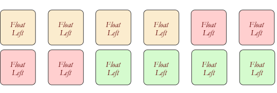
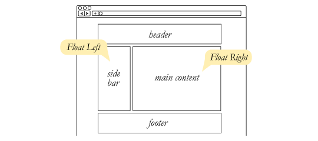
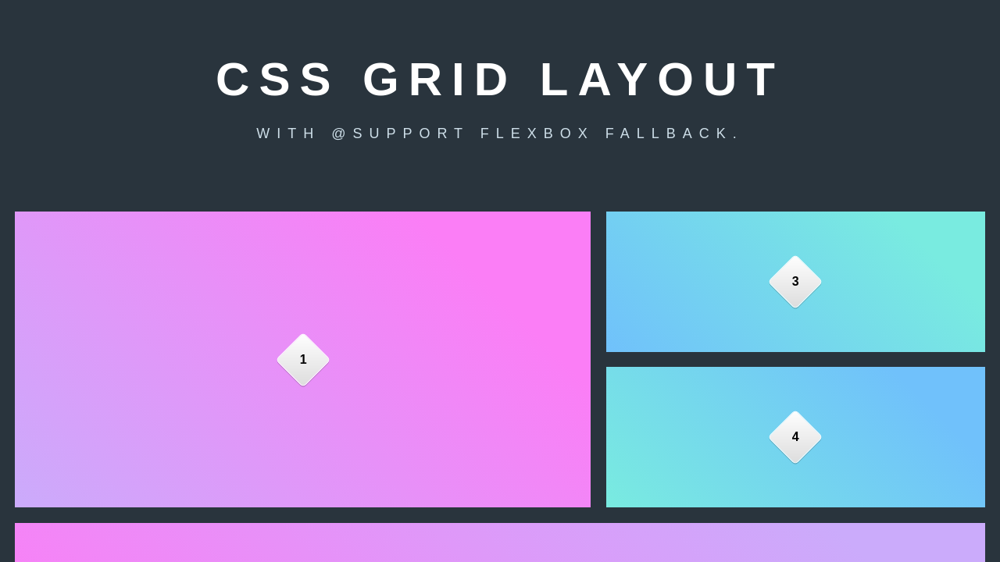

# RESPONSIVE WEB DESIGN

**Responsive Overview**  
Responsive web design is the practice of building a website suitable to work on every device and every screen size, no matter how large or small, mobile or desktop. Responsive web design is focused around providing an intuitive and gratifying experience for everyone. Desktop computer and cell phone users alike all benefit from responsive websites.

**Float**  
The CSS float property allows a developer to incorporate table-like columns in an HTML layout without the use of tables.

If it were not for the CSS float property, CSS layouts would not be possible except using absolute and relative positioning — which would be messy and would make the layout unmaintainable.

**The Clear Property in float**  
There is one more wrinkle that we have not discussed yet: the clear property. “Clear” allows elements to specify where they should align in comparison to the floated elements.

**Grid**  
Grid is like flex and float methods a way to divide the page into main parts like header and navbar and footers.

**What is SMACSS?**  

SMACSS (pronounced “smacks”) is more style guide than rigid framework. There is no library within here for you to download or install. There is no git repository for you to clone. SMACSS is a way to examine your design process and as a way to fit those rigid frameworks into a flexible thought process. It is an attempt to document a consistent approach to site development when using CSS. And really, who isn’t building a site with CSS these days?!
