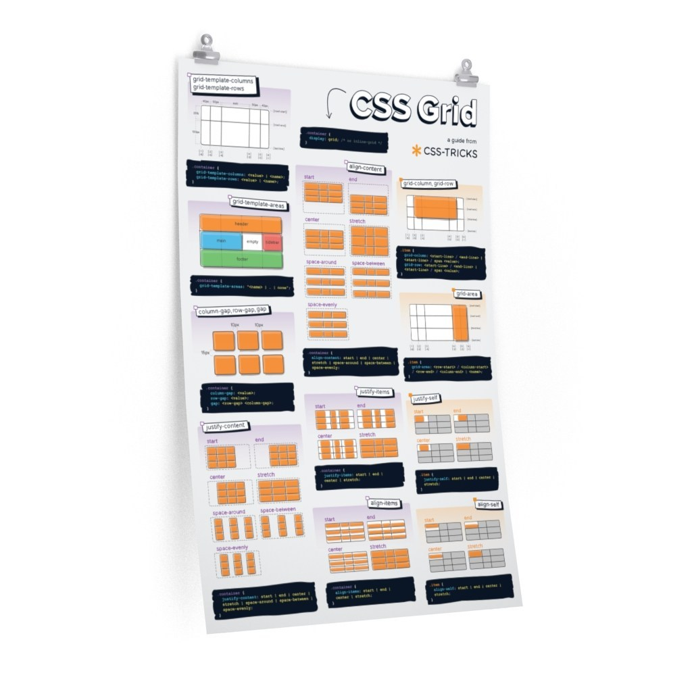

# GRID
CSS Grid Layout is the most powerful layout system available in CSS. It is a 2-dimensional system, meaning it can handle both columns and rows, unlike flexbox which is largely a 1-dimensional system. You work with Grid Layout by applying CSS rules both to a parent element (which becomes the Grid Container) and to that element’s children (which become Grid Items).

## grid-template-areas
Defines a grid template by referencing the names of the grid areas which are specified with the grid-area property. Repeating the name of a grid area causes the content to span those cells. A period signifies an empty cell. The syntax itself provides a visualization of the structure of the grid.

## justify-self  
Aligns a grid item inside a cell along the inline (row) axis (as opposed to align-self which aligns along the block (column) axis). This value applies to a grid item inside a single cell.

