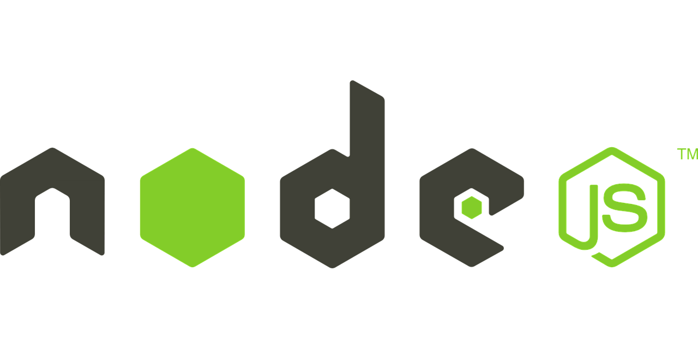

# Node.js

```Node.js is an event-based, non-blocking, asynchronous I/O runtime that uses Google’s V8 JavaScript engine and libuv library.```




Node.js Has Excellent Support for Modern JavaScript
As can be seen on this compatibility table, Node has excellent support for ECMAScript 2015 (ES6) and beyond. As you’re only targeting one runtime (a specific version of the V8 engine), this means that you can write your JavaScript using the latest and most modern syntax. It also means that you don’t generally have to worry about compatibility issues — as you would if you were writing JavaScript that would run in different browsers.


# node with JSON 
**Working with the package.json File**  
If you look at the contents of the test directory, you’ll notice a folder entitled node_modules. This is where npm has saved lodash and any libraries that lodash depends on. The node_modules folder shouldn’t be checked in to version control, and can, in fact, be re-created at any time by running npm install from within the project’s root.

If you open the package.json file, you’ll see lodash listed under the dependencies field. By specifying your project’s dependencies in this way, you allow any developer anywhere to clone your project and use npm to install whatever packages it needs to run.