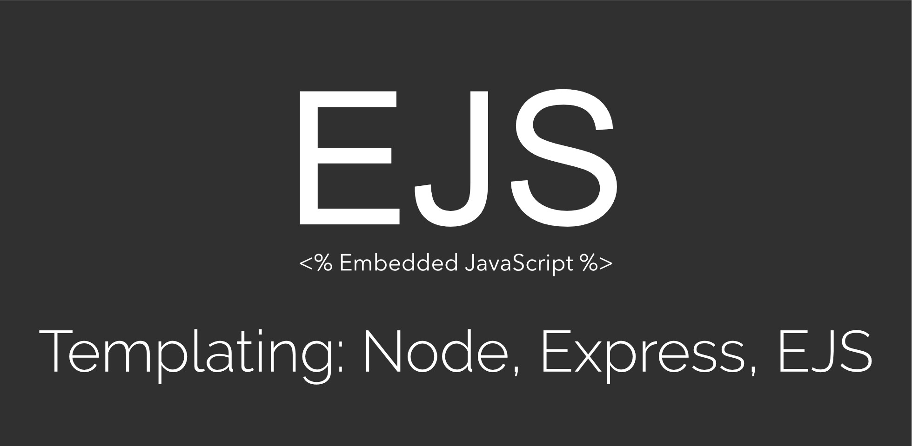

# What is EJS?
What is the "E" for? "Embedded?" Could be. How about "Effective," "Elegant," or just "Easy"? EJS is a simple templating language that lets you generate HTML markup with plain JavaScript. No religiousness about how to organize things. No reinvention of iteration and control-flow. It's just plain JavaScript.

> EJS is a templating engine for for JavaScript. So, font-end stuff.
It seems pretty laissez-faire in that it doesn't tell you how to organise things. Ultimately, EJS is a tool to generate HTML markup with plain Javascript.

*EJS let's us spin up quick applications when we don't need anything too complex. By using partials and having the ability to easily pass variables to our views, we can build some great applications quickly.*

*Currently, EJS doesn't support the ability to have layouts. So far we have just brought in other partials, but not really used layouts the way we would expect templating to work (extending a layout file and passing a view file into that). There have been projects in the past to try to bring templating to EJS. The two main projects are EJS Locals and EJS Express Layouts. These provide the ability to define different layouts like a sidebar layout and a full width layout and then call those on the fly. Sadly, EJS Locals is no longer maintained and EJS Express Layouts doesn't work with Express 4 at the time of this writing. Hopefully that will change in the future.*