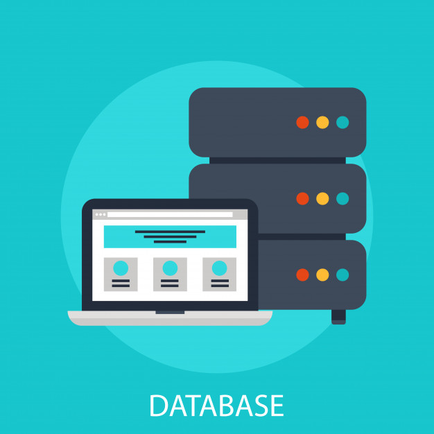

# Database Normalization

Database normalization is a process used to organize a database into tables and columns.  The main idea with this is that a table should be about a specific topic and only supporting topics included. Take a spreadsheet containing the information as an example, where the data contains salespeople and customers serving several purposes:
* Identify salespeople in your organization
* List all customers your company calls upon to sell a product
* Identify which salespeople call on specific customers.

## Reasons for Database Normalization
There are three main reasons to normalize a database.  The first is to minimize duplicate data, the second is to minimize or avoid data modification issues, and the third is to simplify queries. 

