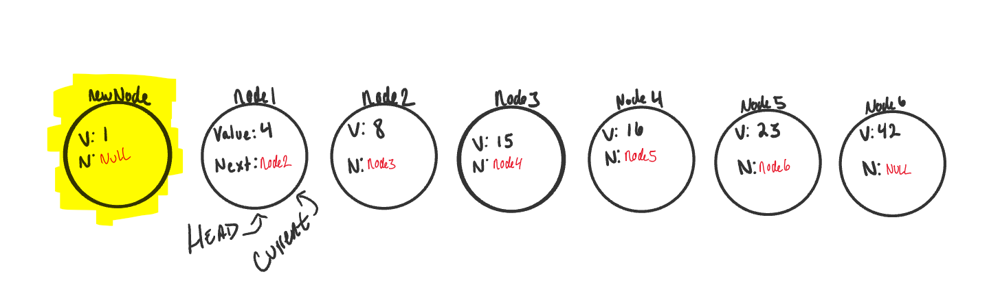

# Linked Lists
### *A Linked List is a sequence of Nodes that are connected/linked to each other. The most defining feature of a Linked List is that each Node references the next Node in the link.*

# There are two types of Linked List:

## 1. Singly
**Singly - Singly refers to the number of references the node has. A Singly linked list means that there is only one reference, and the reference points to the Next node in a linked list.**

## 2. Doubly
**Doubly - Doubly refers to there being two (double) references within the node. A Doubly linked list means that there is a reference to both the Next and Previous node.**

# Adding a Node
Here are the required steps to add a new node with an O(1) efficiency.
* Set Current equal to Head. This will guarantee us that we are starting from the very beginning.
* We can then instantiate the new node that we are adding. The values passed in as arguments into the Add() method will define what the value of the Node will be.

